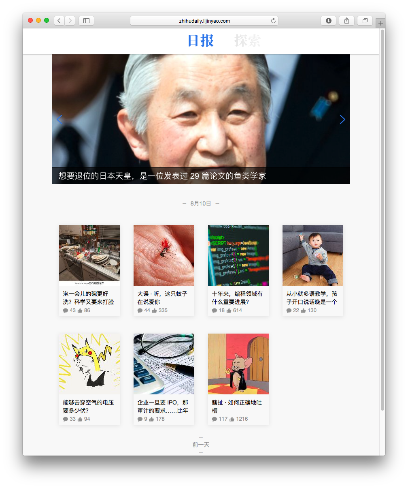

# 知乎日报 with React.js
>声明：『知乎』是 知乎. Inc 的注册商标。本软件与其代码非由知乎创作或维护。软件中所包含的信息与内容皆违反版权与知乎用户协议。它是一个免费软件，使用它不收取您任何费用。其中的所有内容均可在知乎获取。

知乎日报API来自 [知乎日报 API 分析](https://github.com/izzyleung/ZhihuDailyPurify/wiki/知乎日报-API-分析)。

## live demo
[zhihudaily.lijinyao.com](https://zhihudaily.lijinyao.com/)

## Screen shot



## 运行
```
npm install
npm run build
node dist/zhihuDaily/app.js
```
